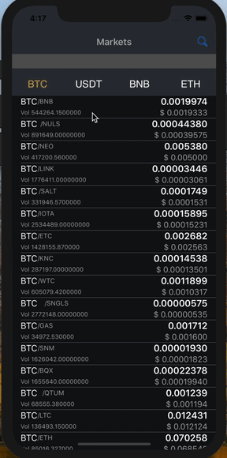

# CustomTableView

<table>
  <tr>
    <th>
      
    </th>
  </tr>
</table>

Requires VPN if using in China

Features:
1) Provides a list of rates for various currencies
2) Allows user to pull to refresh
3) Allows user to filter the table view by the selected tab
4) Allows user to perform search

# Setup

Run the following commands in Terminal after entering the folder where you want to place the project files:

This will clone a local copy of this repository:

`git clone https://github.com/speedoholic/customtableview.git`

Enter the folder containing pod file:

`cd customtableview`

Install the pods:

`pod install`

After successfull installation of Pods, open TradeX.xcworkspace

DONE

Note: You will need to change the bundle id / provisioning team for running the app on your own device.
